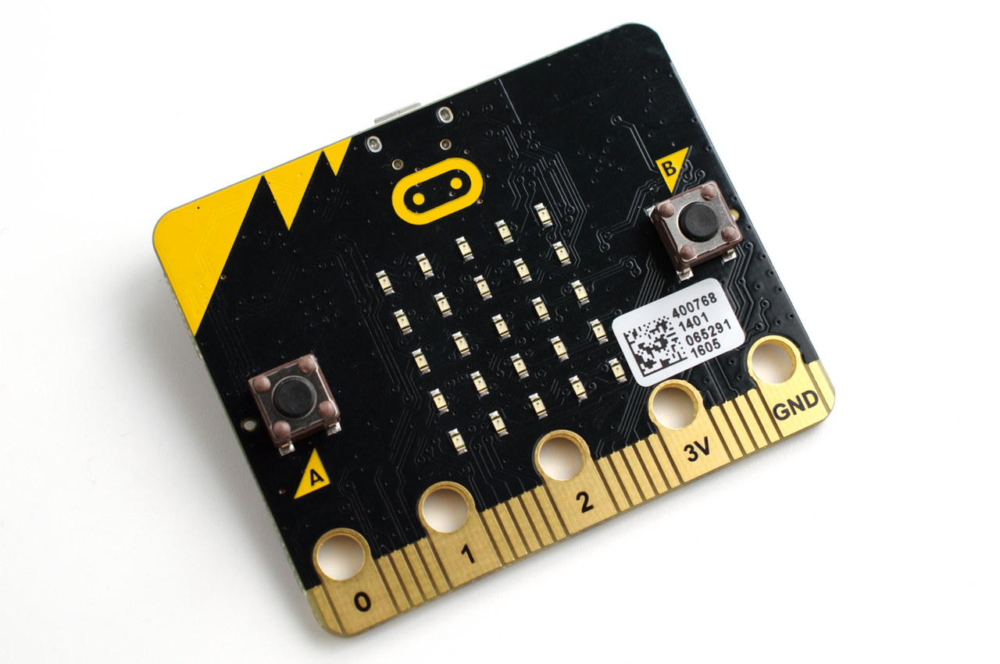

::: {.course-meta-block .quarto-title-meta}
:::: {.quarto-title-meta-heading}
Course dates
::::
:::: {.quarto-title-meta-contents}
 
::::
:::

This course takes place at **Makerere University in Kampala, Uganda**. SLUBI is producing the pre-course materials, quizzes, and hands-on exercises, and Samuel Flores (SLU) will teach and supervise on-site.

Students will learn microcontroller architecture and programming using MakeCode, work with sensors and actuators from the Elecfreaks Smart Health Kit, and build a prototype product in teams of 4–5. Teaching follows the flipped spaced-repetition format.

Pre-course assignments are due before the on-site sessions.

{.class width=60%}

*[Gareth Halfacree from Bradford, UK](https://commons.wikimedia.org/wiki/File:BBC_micro_bit_(26146399942).png), [CC BY-SA 2.0](https://creativecommons.org/licenses/by-sa/2.0), via Wikimedia Commons*

