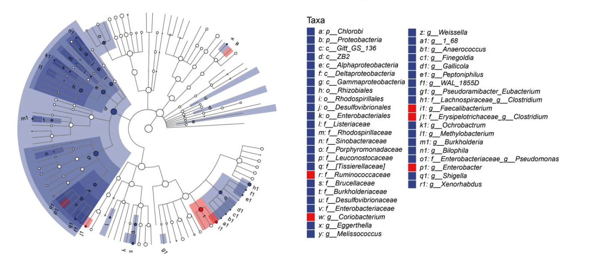

::: {.course-meta-block .quarto-title-meta}
:::: {.quarto-title-meta-heading}
Course dates:
::::
:::: {.quarto-title-meta-contents}
 – 
::::
:::

We are pleased to announce the rerun of our 2023 population genomics course for the end of this year.

Population genetics is an important tool to understand the life cycles of microorganisms causing diseases in plants and is an important part of plant-microbe interactions. The aim of this course is to equip students with knowledge and tools to carry out a population genetic study in any pathosystem.

SLUBI is teaching the bioinformatics part of this masters course (P000185, 4 credits).

After this course, the student will be able to:

- Discuss and critically evaluate population genetic theory and how it can be applied when studying disease causing organisms.
- Design sampling strategies to address a given problem and plan an experiment for molecular-based population biological analysis to answer population genetic and evolutionary questions.
- Work in High-Performance-Computing (HPC) environments for population genetic data analysis.
- Use a scientific workflow system for bioinformatics, such as Nextflow, to run basic population genetic pipelines.
- Apply and interpret core methods and analytical tools available in population genetics.
- Reflect on assumptions, limitations and ethical aspects when drawing conclusions from population genetic analysis.

# Schedule

| Date | Format | Duration | Topic |
|------|--------|----------|-------|
| ~Nov 16th | Online (Zoom) | 1 hour | Introduction to the course |
| 2nd half of November | Online (Zoom) | TBA | Q & A sessions |
| Nov 30th – Dec 3rd (Week 49) | Ultuna | Mon–Thu | Hands-on practical sessions |

: {.striped .hover}

The course is organized by the Department of Forest Mycology and Plant Pathology on behalf of the SLU Organism Biology research school.

 

[{.class width=95%}]()

Ma et al. 2024, AIMS Bioengineering, 10.3934/bioeng.2024021