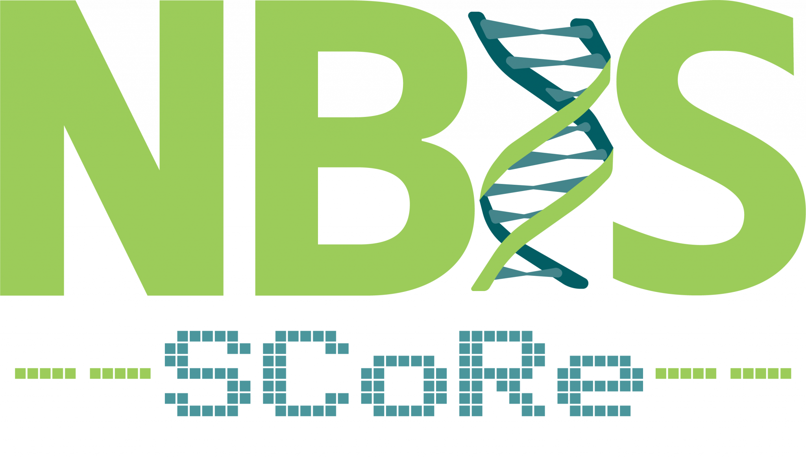

**Dates:** 20–21 April 2026  
**Location:** Stockholm  

SLUBI has been invited to join the upcoming retreat organised by the **Support for Computational Resources (SCoRe)** unit within NBIS/SciLifeLab.

The retreat brings together people working with bioinformatics and high-performance computing support across Sweden. It’s a great opportunity to exchange ideas, share experiences, and connect with colleagues from other institutions.

The meeting will follow a lunch-to-lunch format and include presentations and discussions on how to support computational life science going forward.

We’re looking forward to taking part and to reconnecting with others working in this space.

  

{.class width=40%}
