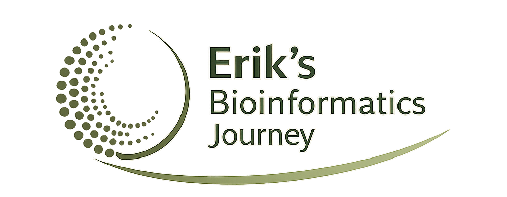

 

::: {.quarto-title-meta}
:::: {.quarto-title-meta-heading}
Date
::::
:::: {.quarto-title-meta-contents}

::::
:::

### Registration

Registration is closed, but you are welcome to just swing by, or contact me at amrei.binzer.panchal@slu.se for more information. 

---

[{.class width=40%}]()

This symposium celebrates the career and impact of Prof. Erik Bongcam-Rudloff, whose work has contributed to the development of bioinformatics at SLU and fostered international collaborations across continents.

The program will bring together colleagues, collaborators, and researchers to reflect on advances in bioinformatics and its global community.

---

### Event details

**When:** May 15th, 12:00 – 17:00  
**Where:** Loftets Hörsal, Duhrevägen 8, Ultuna, Uppsala  

<iframe src="https://www.google.com/maps/embed?pb=!1m14!1m8!1m3!1d3667.303175741931!2d17.6606613!3d59.8151526!3m2!1i1024!2i768!4f13.1!3m3!1m2!1s0x465fc9912556a485%3A0xa88f783c992dd80f!2sLoftet-%20dinner%20venue!5e1!3m2!1sde!2sse!4v1778761796971!5m2!1sde!2sse" width="600" height="450" style="border:0;" allowfullscreen="" loading="lazy" referrerpolicy="no-referrer-when-downgrade"></iframe>

---

## Program

| Time | Speaker | Title |
|:---|:---|:---|
| **12:00 – 13:00** |  | Lunch |
| **13:00** | Álvaro Martínez Barrio, Thermo Fisher Scientific PSX | *Three Bioinformatic Generations in 30min* |
| **13:30** | Ola Spjuth, Uppsala University | *Science is a team sport* |
| **14:00** | Andreas Gisel, IITA Nigeria | *Epigenetics in Cassava* |
| **14:30** | Tomas Klingström, Gigacow, SLU | *SLU Gigacow – Building an informatics platform to accelerate dairy cattle research* |
| **15:00** |  | Fika |
| **15:30** |  | Panel discussion:  *Collaborations in Science* |
| **16:00** | Erik Bongcam-Rudloff, SLU | *Why Research? How Did It Go? Was It Worth It? — Reflections on a Life in Science* |

---

### Evening

| Time | Activity |
|:---|:---|
| **18:00 – 23:00** | Dinner |

---

 

[{.class width=60%}]()
