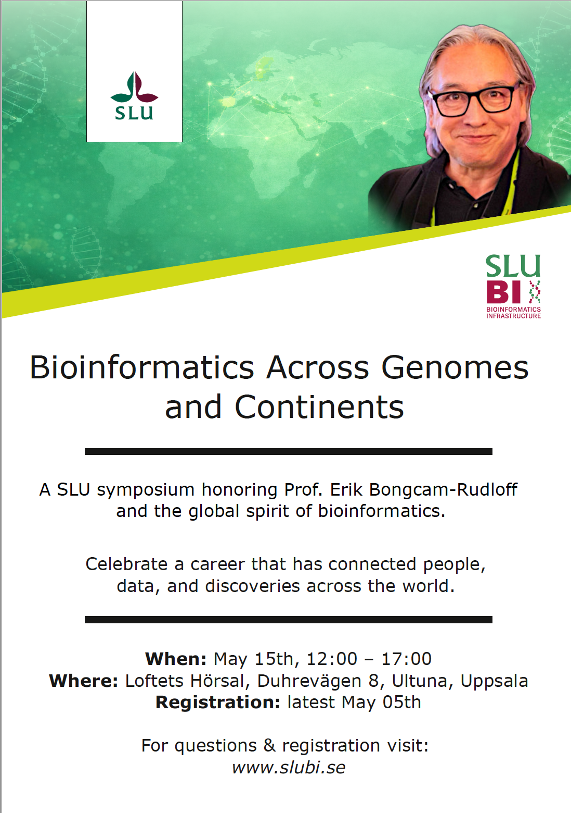

 

::: {.quarto-title-meta}
:::: {.quarto-title-meta-heading}
Date
::::
:::: {.quarto-title-meta-contents}

::::
:::

This symposium celebrates the career and impact of Prof. Erik Bongcam-Rudloff, whose work has contributed to the development of bioinformatics at SLU and fostered international collaborations across continents.

The program will bring together colleagues, collaborators, and researchers to reflect on advances in bioinformatics and its global community.

---

### Event details

**When:** May 15th, 12:00 – 17:00  
**Where:** Loftets Hörsal, Duhrevägen 8, Ultuna, Uppsala  

---

### Registration

**Registration deadline:** May 5  

Please [register here](https://docs.google.com/forms/d/e/1FAIpQLSd_3_h5jgkrp7CYjHkaApCyu2PhfMcfflf3LbwDfAbPv2bTzw/viewform), and write to amrei.binzer.panchal@slu.se if you encounter any troubles. 

---

### Program

Details of the program and speakers will be announced soon.

 

[{.class width=60%}]()
