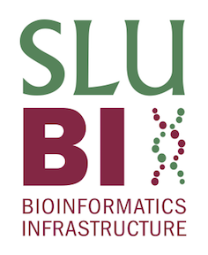

 

::: {.quarto-title-meta}
:::: {.quarto-title-meta-heading}
Date
::::
:::: {.quarto-title-meta-contents}
 - 
::::
:::

We are pleased to introduce the new board members of SLUBI, with representatives from across SLU’s faculties. The board will work to support ongoing activities and explore how SLUBI’s core services can continue to benefit the community.

## Head of the Board

**Dirk-Jan de Koning**: 

Professor in Animal Breeding, Faculty of Veterinary Medicine and Animal Science (VH), Ultuna.
Pro Vice-Chancellor for Research Infrastructure at SLU.

## Faculty Representatives

- **Anna Wallenbeck** (VH, Ultuna)
- **Ove Nilsson** (S, Umeå)
- **Aakash Chawade** (LTV, Alnarp)
- **Pär Ingvarsson** (NJ, Uppsala)

We thank the departing board members for their service and the new ones for their commitment. We look forward to working together in the coming year.

[See the full board and profiles here](../../../board.qmd).

  

{.class width=40%}