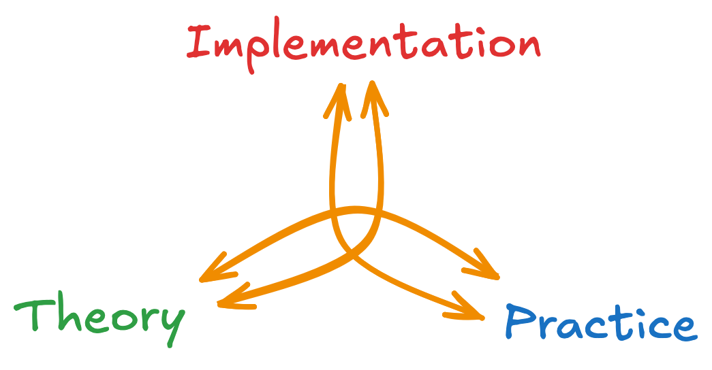

::: {.course-meta-block .quarto-title-meta}
:::: {.quarto-title-meta-heading}
Date & time
::::
:::: {.quarto-title-meta-contents}
 – , Campus Alnarp
::::
:::

This workshop covers both the theory and practical aspects of AI literacy and implementation. It takes place on Campus Alnarp and combines a theoretical introduction with hands-on exercises.

The workshop is platform- and LLM-agnostic and open to everyone — no prior experience with AI tools required.

{.class width=60%}