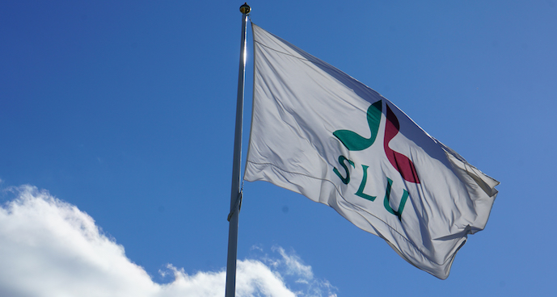
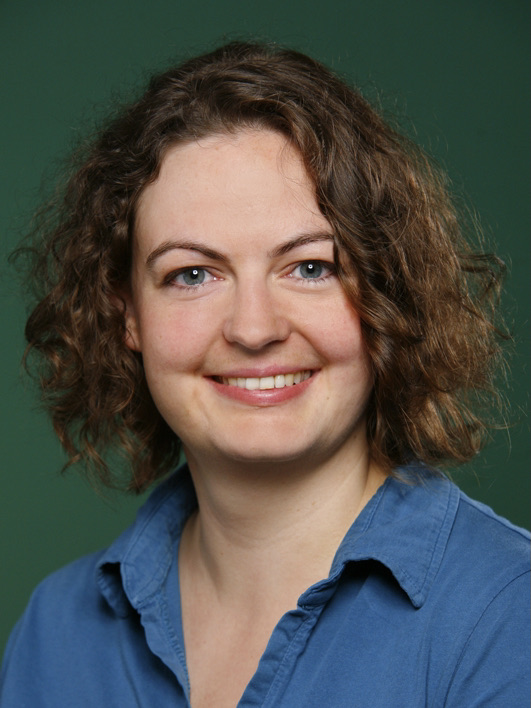
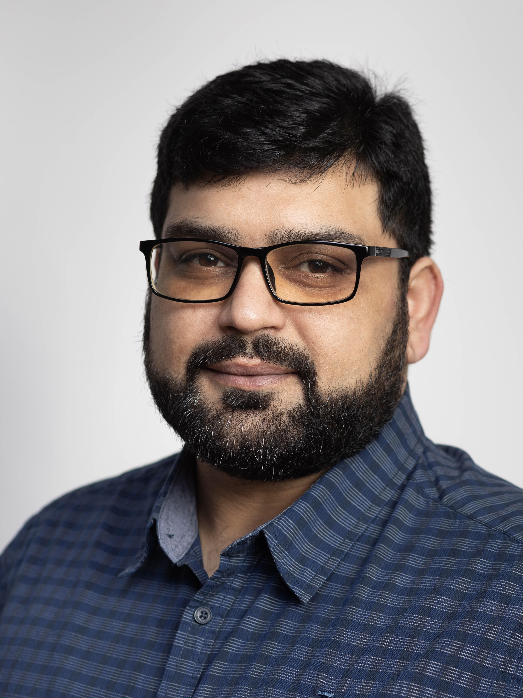
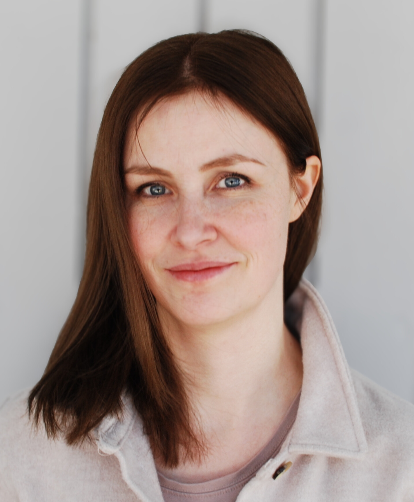
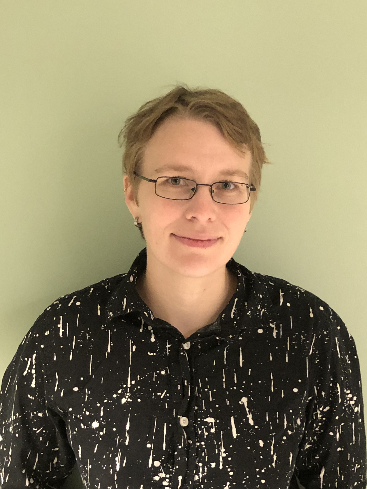
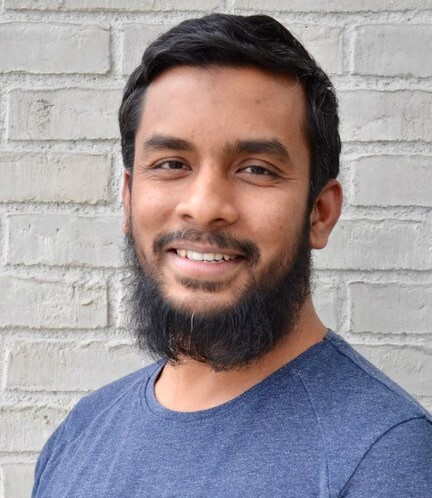
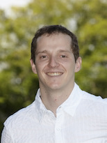
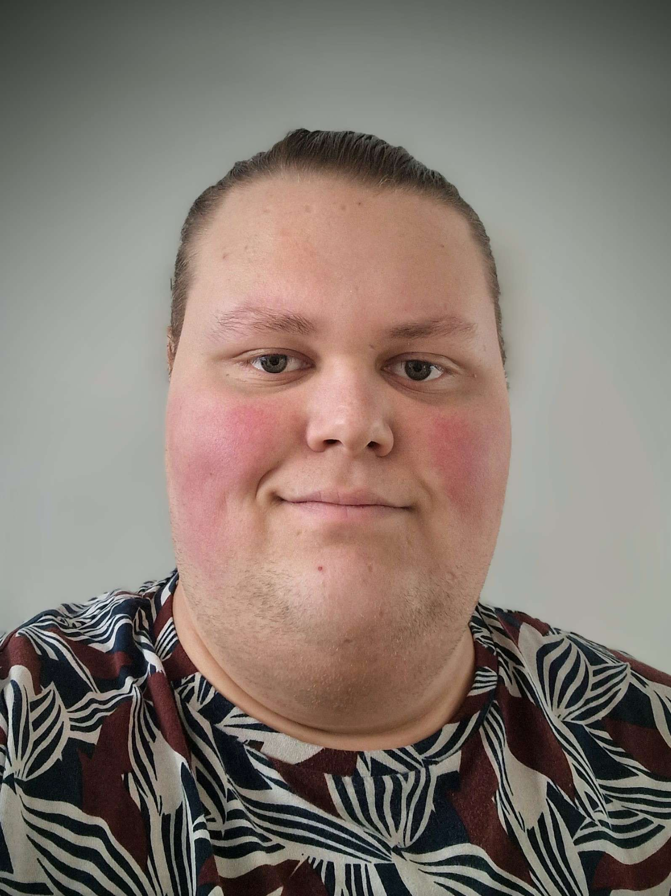

 

# Our goal

Our goal is to provide support and training in bioinformatics for SLU staff, and to build a strong community of bioinformaticians within SLU. Our staff is located on the 3 SLU campuses in Ultuna, Umeå and Alnarp. We want to join forces and coordinate teaching activities, common resources (hardware, software).

We also serve as a link to the broader bioinformatics community in Sweden, such as the [National Bioinformatics Infrastructure Sweden, NBIS](https://nbis.se/), facilitating collaboration and knowledge exchange.

{.class width=45% height=75%}

 

# Our team

We are a group of skilled bioinformaticians. Please klick on us to see more about our background. 

::::: {layout-ncol=2}
:::: {.card}
::: {.card-body}
 

[{.class width=50%}](amrei.qmd) 

 
[Amrei Binzer-Panchal, bioinformatician in Ultuna (VH faculty)](amrei.qmd): head of the infrastructure, and expert in analysing RNAseq, methylation data, microarrays, and 10x single cell RNAseq data.
:::
::::

:::: {.card}
::: {.card-body}
 

[{.class width=50%}](adnan.qmd)

 
[Adnan Niazi, bioinformatician in Ultuna (VH faculty)](adnan.qmd): our expert in RNAseq, metabarcoding (16S/18S/ITS), epigenomics (WGBS/RRBS), genome assembly and annotation.
:::
::::

:::: {.card}
::: {.card-body}
 

[{.class width=50%}](sara.qmd)

 
 
[Sara Rydman, bioinformatician in Umeå (S faculty)](nicolas.qmd): our expert in metabolomics, RNA-sequencing, genome-wide association studies (GWAS), eQTL mapping, and network analyses.
:::
::::

:::: {.card}
::: {.card-body}
 

[{.class width=50%}](lizel.qmd)

 
[Lizel Potgieter, bioinformatician in Alnarp (LTV faculty)](lizel.qmd): our plant breeding, comparative genomics, population genomics, variant calling, genome assembly and annotation expert.
:::
::::

  

 

:::: {.card .mb-4}
::: {.card-body}
 

[{.class width=50%}](abu.qmd)

 
[Abu Bakar Siddique, bioinformatician in Ultuna (NJ faculty)](abu.qmd): our expert in metagenomics, DNASeq, shotgun seq, metabarcoding (ITS), WGS analysis, read mapping, genome assembly and annotation. With wetlab experience in DNA, PCR and HTS library prep.
:::
::::
:::::

## Former members

We would like to give a big thank you to our former colleagues for their important contributions to SLUBI. We truly enjoyed working with them and wish them all the best in their exciting new roles.

::::: {layout-ncol=2}
:::: {.card}
 

 [{.class width=50%}](nicolas.qmd) 
   [Nicolas Delhomme, former bioinformatician and UPSC Bioinformatics Facility Manager in Umeå (S faculty)](nicolas.qmd): now WIFORCE Data Center Coordinator. 
::::

:::: {.card}
 

 [{.class width=50%}](renaud.qmd) 
   [Renaud Van Damme, former system administrator and bioinformatician (VH faculty)](renaud.qmd): now researcher for the GigaCow project at SLU. 
::::
:::::
